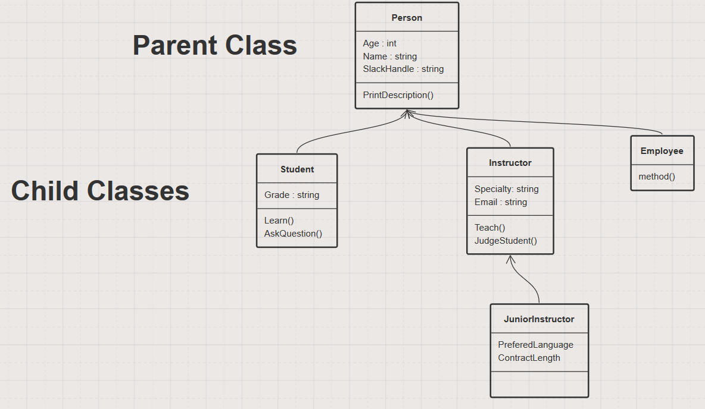

# Abstraction, Modeling, Inheritance and Interfaces... Oh My!

## Notes

* Abstraction
  * a concept
  * a thought
  * what's left over when you remove all the uninteresting properties of a thing

* Example - A Car
  * make
  * model
  * color
  * number of wheels
  * type of engine
  * manual or automatic transmission
  * X - wheel drive

* In the example above we might think about a car as a "model"

* Model represents something in the real world
* A model is an abstraction
* Models are often used to predict the future or, at least, try to understand the present (or understand something)
* Example - a weather model
  * a computer program that "models" the actual weather on a planet
  * made up of classes, methods, properties, etc...

* "All models are wrong, some are useful" - George Box

* Classes are models
  * We've created classes for Persons, Dogs, Shiny Hats, etc...
  * We have NOT created Person, Dogs or Shiny Hats

* Inheritance
  * A way to share code between classes - Don't Repeat Yourself (DRY)
  * It's a way to define an `is-a` relationship
    * ex: a `Student` is a `Person`
  * A child class inherits from a parent class
    * child class is also known as a "sub class" or a "derived class"
    * parent class is also known as a "super class" or a "base class"
  * The model of inheritance in programming is one of a child inheriting genetic traits from their parent
  * use a `:` to denote an inheritance relationship
    * `class FooChild : BarParent `
  * Overriding methods and properties
    * in the parent class you must mark the method or property as `virtual`
    * in the child class you must mark the method or property as `override`
  * "Single Inheritance" - In C# a class can only **directly** inherit from  _one_ class.
    * However, it is **not** required that a class inherit from another class

* polymorphism
  * "many forms"
  * refers to the ability to use an instance of a child class where an instance of a parent class is expected.

**Class Diagram - Inheritance**

**Interfaces**

* Interfaces
  * define properties and methods that a class MUST implement
    * not used for fields
  * a "contract" the class must adhere to
  * **an interface creates a new "type"**
    * this means a variable can be of an interface type
  * all properties and methods are public, so we don't use the world `public`
  * Class can implement multiple interfaces
    * but inherit from only one other class

**Class Diagram - Interfaces**

