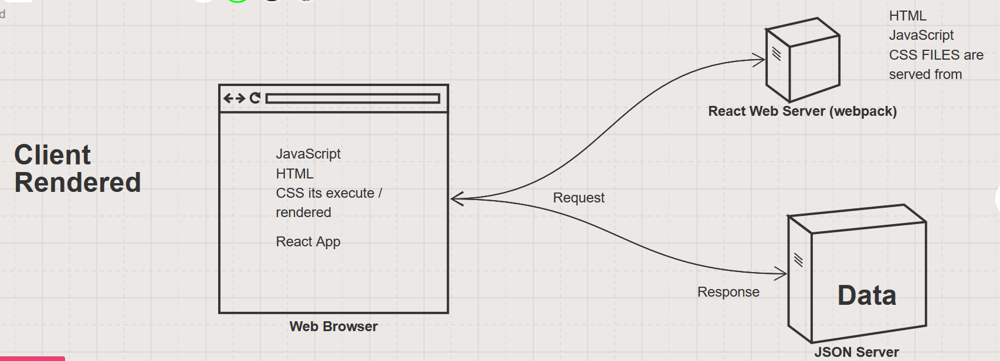
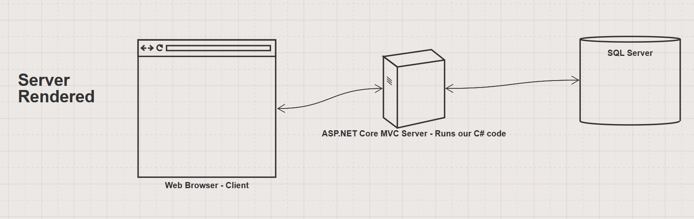

# ASP.NET Core MVC

ASP.NET Core is Microsoft web application framework. It is the collection of classes and tools that we use to build a web application in C#.

## Vocabulary

* **Request / Response** - This is a pattern of communication between _clients_ and _servers_. A client sends a _request_ and a server responds with a _response_.
* **Rendering** - The process of dynamically generating HTML using a programming language
* **Client-side Rendered App** - a JavaScript heavy web application that generates HTML in the web browser. Apps build with React, Angular or Vue are examples of client-side apps.
* **Server-side Rendered App** - an application that generates it's HTML on the web server. ASP.NET Core/C#, PHP, Django/Python apps are all examples of server-side rendered apps.
  > Always ask yourself "Where does the code run?" Is it the on the client or the server?
* **MVC (Model View Controller)** - This is a _pattern_ for building server-side web applications using _Model_ classes, _Controller_ classes and _View_ templates
  * **Model** - a class that represents a database table
  * **Controller** - a class with methods that respond to HTTP requests. Each method in a controller responds to a particular route. The code in each method will get data from a database or update data in a database using a _Repository_ and then respond with a _View_.
  * **View** - an HTML template that transforms data into HTML
* **ASP.NET Core MVC** - This is the name of the portion of the _ASP.NET Core_ framework that we use to build a web application that uses the MVC pattern
* **Razor Template (`*.cshtml` files)** - Files that contain a combination of HTML and C# code. Used to render HTML. The _view_ part of MVC

## Some parts of an ASP.NET Core App

* **appsettings.json** - a configuration file for the app. In particular this file will contain a database _connection string_.
* **Startup.cs** - another configuration file for the app. This file contains C# code that runs when the app starts to prepare the application to accept HTTP requests.
* **Folder Structure** - These are the directories that Visual Studio creates when it first makes the project.
  * **Controllers** - Should contain _controller_ classes. Controllers should be named with a "-controller" suffix. For example: _HomeController_ or _WalkersController_.
  * **Models** - Should contain _model_ classes
  * **Views** - Should contain razor, `*.cshtml`, files

## Client vs Server Rendered Apps

### Client

### Server

### MVC Request / Response Flow

This is the flow for a request to `/walkers/details/3`

You can find the code in the `DogGo` folder.

1. Browser (Client) makes an HTTP GET Request to `https://localhost:5001/Walkers/Details/3`
1. The ASP.NET Core Server is listening for requests on port `5001` and receives the request to the `/Walkers/Details/3` route
1. ASP.NET Core checks its "endpoints" table from the `Startup.cs` file to determine how to associate the route with a controller and a method.
    * by default this will tell it to call the `Details` method on the `WalkersController`
1. ASP.NET Core tries to create an instance of the `WalkersController` class, but sees that the constructor requires a parameter of type `IWalkerRepository`. So it knows it needs to create an object of that type.
1. ASP.NET Core has to lookup what class to use BECAUSE `IWalkerRepository` is an interface and not a class, it CANNOT be directly instantiated.
1. ASP.NET Core looks at the registered services in the `Startup.cs` file to find the correct class to instantiate.
    * It finds the `services.AddTransient<IWalkerRepository, WalkerRepository>();` line in the `ConfigureServices` method.
1. ASP.NET Core then tries to create an instance of `WalkerRepository` BUT it can't because the constructor requires and `IConfiguration` parameter. FORTUNATELY, ASP.NET Core knows how to make an `IConfiguration` object without us telling it how, so it does.
1. NOW, FINALLY, ASP.NET Core can create a `WalkerRepository` and then it can create a `WalkersController`, so it does.
1. Once ASP.NET Core has a `WalkersController` object, it can then call the `Details` method passing in the `3` as an argument.
    * The `3` is the route parameter that represents the `id` of the Walkers we're looking for.
1. The `Details` method calls the `WalkerRepository.GetWalkerById()` method passing in the `id` (which is `3` in this case)
1. The `GetWalkerById` method executes a `SELECT` query to the database and uses the data returned from the query to create a `Walker` object which it returns to the `Details` method.
1. The `Details` method passes the `Walker` object into the `Views/Walkers/Details.cshtml` view.
1. The `Details.cshtml` view takes the `Walker` object and combines the values of its properties along with the HTML that's inside the view to generate HTML.
1. ASP.NET Core takes the HTML and wraps it in the HTML that's inside the `Views/Shared/_Layout.cshtml` file to generate an HTTP Response.
1. ASP.NET Core (server) sends this Response back down to the browser (client)
1. The browser reads the HTML and generates the web page.

### Q & A Notes

* ADO.NET
  * The set of classes provided by .NET to interact with a relational database
    * select, insert, update, delete
    * very low-level code
  * Some classes and methods provided by ADO.NET
    * SqlCommand
    * SqlConnection
    * SqlDataReader
      * GetString()
      * GetInt32()
      * GetBoolean()
    * DbNull
    * DbConnection
    * DbCommand
    * DataReader
  * Inside the "Microsoft.Data.SqlClient" nuget package
  * Alternatives to ADO.NET
    * Entity Framework, NHibernate, Dapper
      * ORM
* ASP.NET Core
  * Web framework from Microsoft
  * Used to build web applications
    * Server-Side Rendered with MVC
    * JSON Web APIs with "Web API"
  * Controllers
  * Views
  * Routing

* .NET
  * It's a set classes created by Microsoft to help us write applications.
    * Base Class Library (BCL)
      * Examples
        * Sting
        * Int32
        * Console
        * DateTime
        * List<>
        * Dictionary<>
  * It's also the "runtime" - the program that executes our C# applications
    * Common Language Runtime (CLR)
    * Literally the command `dotnet`
    * This is similar to the way that the "runtime environment" for javascript is the web browser.

* Where do you start when building an app?
  * Pick a "vertical slice" and write the code you need to make that work
    * Model
    * Repository methods
    * Controller methods
    * Views

* CSS in an MVC app?
  * wwwroot/css/site.css

* `this` in C#?
  * Refers to the "current object" that is an instance of the class in which it is used
  * it is very rarely used, but cause it's implicit
  * FYI - there is a `this` in JavaScript

* Method "overloading"
  * When you have two (or more) methods in a class with the same name and different parameters.

* `ActionResult`
  * a parent class that represents some kind of response from a controller method (aka "action")
  * the type of object that's returned from a controller method
  * A controller method always returns some kind of object that is a child class of `ActionResult`
    * Examples
      * `ViewResult`
      * `NotFoundResult`
      * `RedirectToActionResult`
