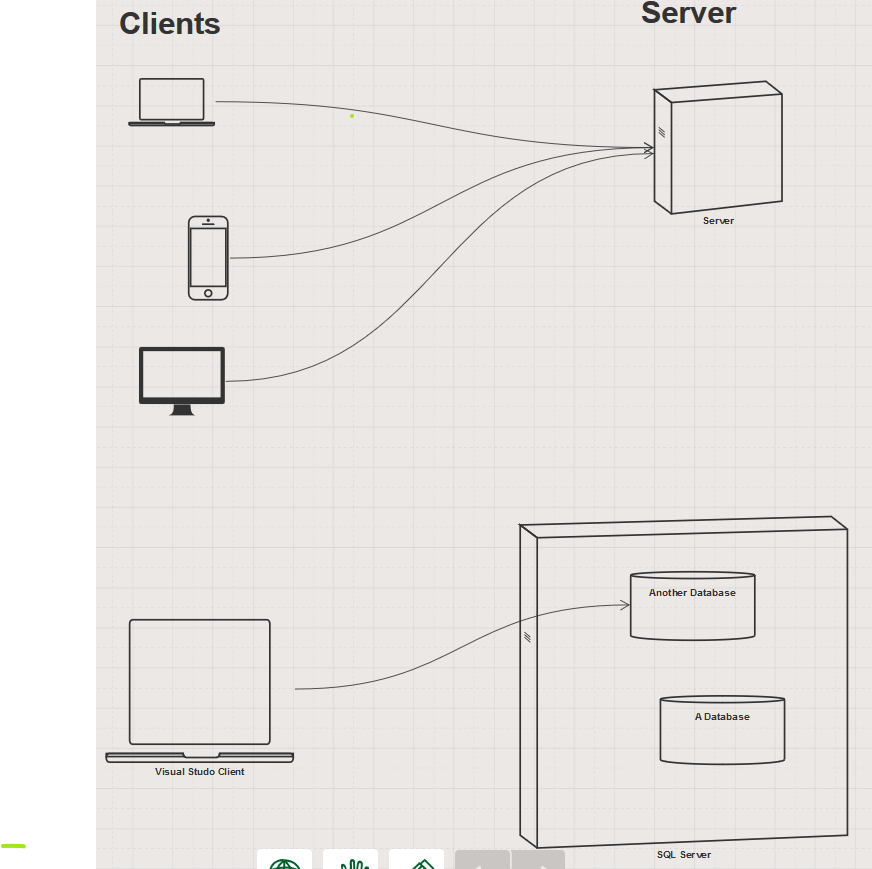

# SQL - Structured Query Language

## Notes

* SQL Server
  * Microsoft Product
  * Relational Database Management System (RDBMS)
    * It's a container for databases
  * Software that's running on your computer
  * Windows Service 
    * Some kinda of background program that doesn't have a UI
  * Set to startup when Windows starts

* Clients and Servers
  * Client
    * One person is using it
    * Overloaded
      * Can refer to a computer / phone / tablet / etc...
      * Or It can refer to a piece of software running on a computer
        * Examples: 
          * Web Browser
          * Mobile App
          * Visual Studio SQL Server Object Explorer
          * git
  * Server
    * Multiple clients connect at once
    * Overloaded term
      * Can refer to a computer running in the cloud or in a datacenter
      * Or it can refer a piece of software running on a computer
        * Examples
          * serve
          * json-server
          * web servers (maybe running an external api)
          * GitHub
          * RDBMS
            * SQL Server
            * Postrgresql (another database system)
  * Communication between clients and servers
    * Request / Response Pattern
      * Client makes a request
        * example
          * fetch()
      * Server sends a response
        * example
          * API returning data

* Relational Database
  * A database composed of tables and relationships between them
  * Table?
    * Grid of data
    * Rectangle of data
    * No "nested" data
    * Composed of rows and columns
      * each row is a single record
      * columns refers individual fields in a row
  * Relationships
    * composed of primary and foreign keys
    * one-to-many
    * many-to-many
  * Still model a relational database with an ERD

* SQL - Structured Query Language
  * Basics of SQL are "standard" across different database systems, but all RDBMSs have their own quirks
  * Supports all CRUD operations
    * Create - Insert
    * Read   - Select
    * Update - Update
    * Delete - Delete
  * Also has features to Create and Delete tables
  * Declarative language
    * You tell the database **what** you want now **how** to give it to you

